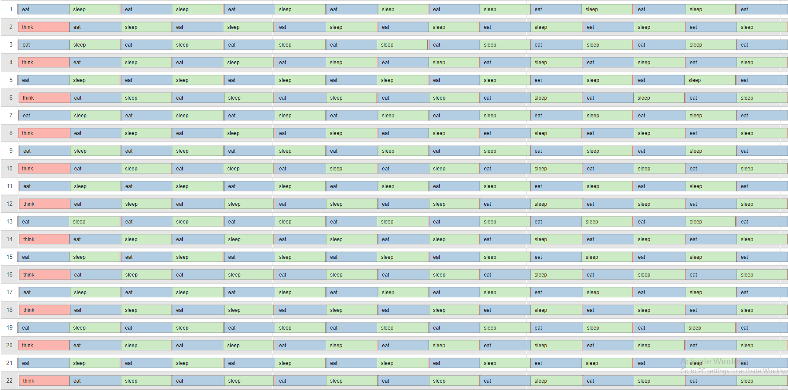
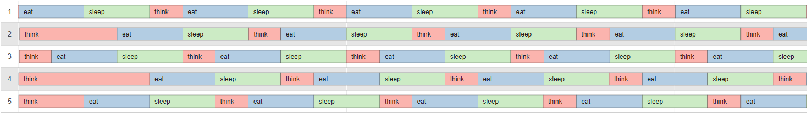
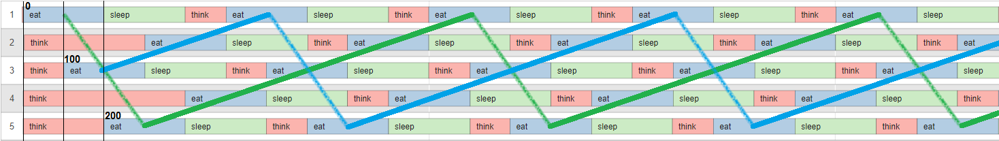
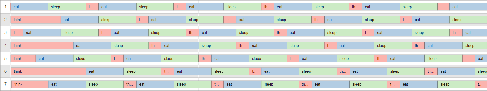
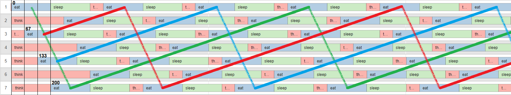
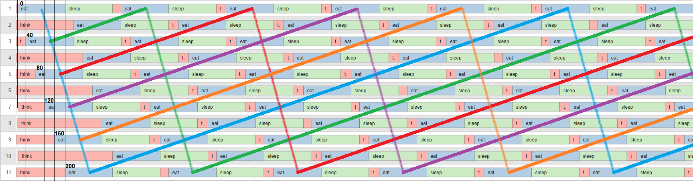
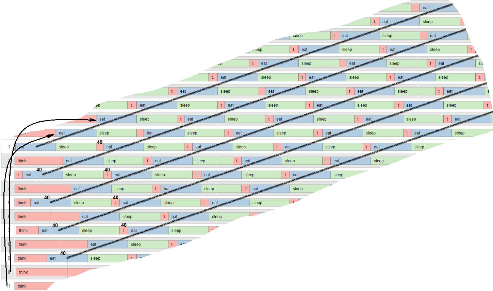
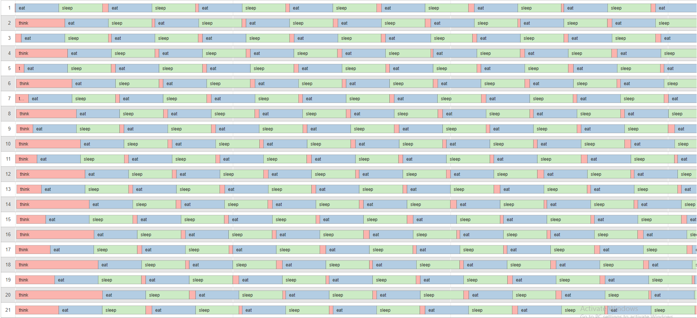
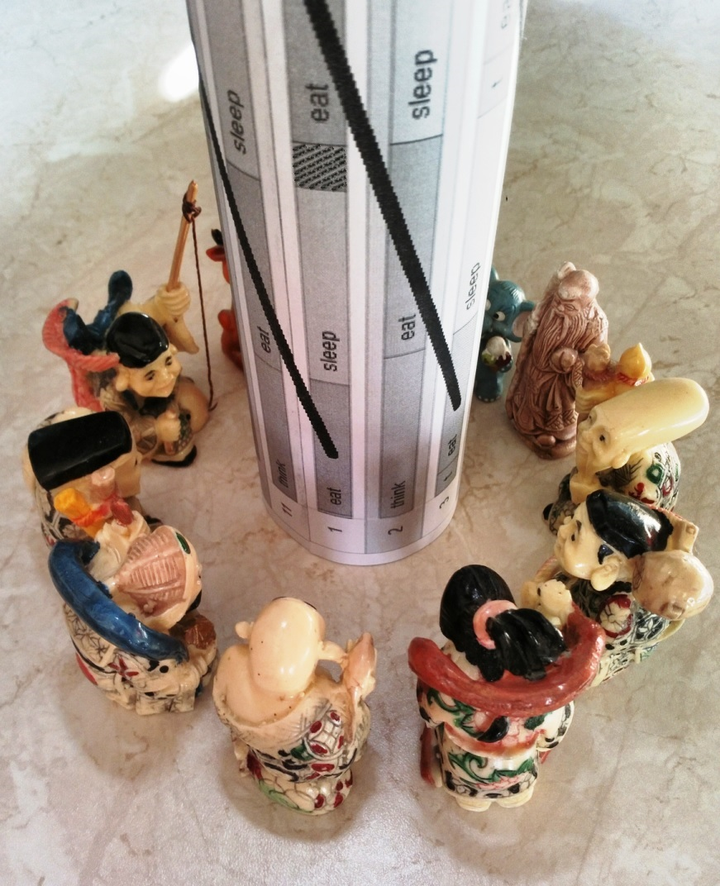

## Классическая задача об обедающих философах
Могут ли философы в нечетном своем количестве так же эффективно поедать спагетти (т.е. без времени "на подумать" \[философы... без "подумать"... хмм...\]) как и четном? Оказывается могут, но лишь тогда, когда их число достаточно велико.

Возьмем, например, случай ./philo 5 800 200 200 из чеклиста. Можно ли оптимизировать очередь взятия вилок таким образом, чтобы вариант ./philo 5 (500 + ?) 200 200 (где  ? - некий параметр, зависящий от отклика системы и оптимизированности кода; положим для простоты ? ~ 10 мс) работал бесконечно долго? Да, оказывается можно это сделать вот в таком виде:

Как видно, первый философ начинает есть сразу, а третий философ запускается с задержкой в половину времени, отведенного на еду. Остальные ждут своей очереди. Уже сейчас можно выделить пару цепочек философов, в каждой из которой очередной сосед слева последовательно начинает принимать пищу практически без задержек:

А что же в случае 7-ми философов? Работает вариант ./philo 7 (467 + ?) 200 200 :

Теперь третий философ запускается с задержкой в треть от времени, отведенного на еду, а пятый - в две трети. Остальные дожидаются своей очереди. "Сцепленных" лево-право последовательностей философов теперь три:

Случай для 11-ти философов ./philo 11 (440 + ?) 200 200 :

Здесь уже просматривается пять цепочек философов. Временной интервал между  цепочками сократился. Нечетные философы относительно друг друга запускаются с задержкой, равной одной пятой от времени, отведенного на еду:

Идем дальше: для 21 философа программа должна отработать с параметрами ./philo 21 (420 + ?) 200 200 , а для 101 уже с ./philo 101 (402 + ?) 200 200 . Как видно, с увеличением числа философов, времени "на подумать" совсем не остается:

Пришло время подтвердить наблюдения расчетами.
Для простоты предположим, что время философа, потраченное на сон, не превосходит времени потраченного на еду.
Формула для вычисления времени задержки старта для нечетного философа в случае нечетного их числа (>1): 
time_to_wait = (time_to_eat / (philo_count / 2)) * (philo_id / 2)
\[Здесь и далее - деление целочисленное, с отбрасыванием дробной части\] 
Тогда минимальное время между предыдущим и последующим приемом пищи  вычисляется следующим образом:
time_cycle = time_to_eat * 2 + time_to_eat / (philo_count / 2)
Как видно, при увеличении количества нечетного числа обедающих философов, время их жизненного цикла стремится к удвоенному времени на еду, так же как и для четного их числа. Предположение, высказанное вначале - подтверждается.
Стоит отметить, что неважно,  какой случай мы рассматриваем - четный или нечетый - можно всегда утверждать, что обедающие философы формируют собой наборы независимых сцепленных последовательностей в количестве chain_count = philo_count / 2, в каждой из которых сосед слева принимается за еду, как только его сосед справа освобождает вилку. Эти цепочки разнесены временем не меньшим, чем 
waste_time = time_to_eat / (philo_count / 2) 
для нечетного случая (которое стремится к нулю при увеличении числа философов) и исполняются практически параллельно для четного, то есть с waste_time = 0 .

